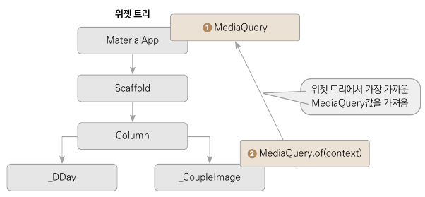

# 만난 지 며칠 U&I

## setState() 함수
* state를 상속하는 모든 클래스는 setState() 함수를 사용
* setState() 함수가 실행되는 과정
  * ①클린 상태 → ②setState() → ③더티 상태 → ④build() → ⑤클린 상태 ... (반복)
  * ① StatefulWidget의 렌더링이 끝나면 클린(clean) 상태
    * 플러터에서는 그 어떤 상태 변경 툴을 사용하든 클린 상태에서 상태를 변경해줘야 함.
  * ② setState()를 실행해서 원하는 속성들을 변경
  * ③ 속성이 변경되고 위젯의 상태가 더티(dirty)로 설정
  * ④ build() 함수 재실행
  * ⑤ State가 클린(clean) 상태로 다시 되돌아 옴

## showCupertinoDialog() 함수
* iOS 스타일로 다이얼로그가 실행됨
```dart
import 'package:flutter/cupertino.dart';  // cupertino 패키지 임포트

showCupertinoDialog(                  // Cupertino 다이얼로그 실행
  context: context,                   // BuildContext 입력
  barrierDismissible: true,           // 외부 탭해서 다이얼로그 닫을 수 있게 하기
  builder: (BuilContext context) {    // 다이얼로그에 들어갈 위젯
    return Text('Dialog')  
  },
);
```
* 배리어 (barrier)  : 플러터에서 다이얼로그 위젯 외에 흐림 처리가 된 부분
  * ex) 다이얼로그 위젯의 높이 300, 화면 전체 높이 1000, 나머지 700의 영역이 배리어가 됨

## .of 생성자
* .of(context)로 정의된 모든 생성자는 일반적으로 BuildContext를 매개변수로 받음.
* 해당 컨텍스트가 실행되는 위젯 트리 상에서 가장 가까이 있는 객체의 값을 찾아낸다.
* MediaQuery.of(context)는 현재 위젯 트리에서 가장 가까이 있는 MediaQuery값을 찾아냄.

* ① 앱이 실행되면 MaterialApp이 빌드되면서 MediaQuery가 생성됨.
* ② 위젯 트리의 아래에서 MediaQuery.of(context)를 실행하면 위젯 트리로 올라가며 가장 가까운 곳에 있는 MediaQuery 값을 가져온다.
  * 비슷한 형태로 Theme.of(context), Navigator.of(context)등이 있음


## 구현 이슈 
* GestureTapCallback 타입의 변수를 이용해서 파라미터로 Callback 함수를 넘길 수 있다.
* Align 위젯 : 자식 위젯을 어떻게 위치할 지를 정할 수 있다.
  * 현재 Align 위젯이 포함된 자식의 위젯 위치를 지정할 수 있다.
* showCupertinoDialog
  * barrierDismissible
    * true : 배경을 터치하면 다이얼로그가 닫힘
    * false : 배경을 터치해도 다이얼로그가 닫히지 않음.
  

